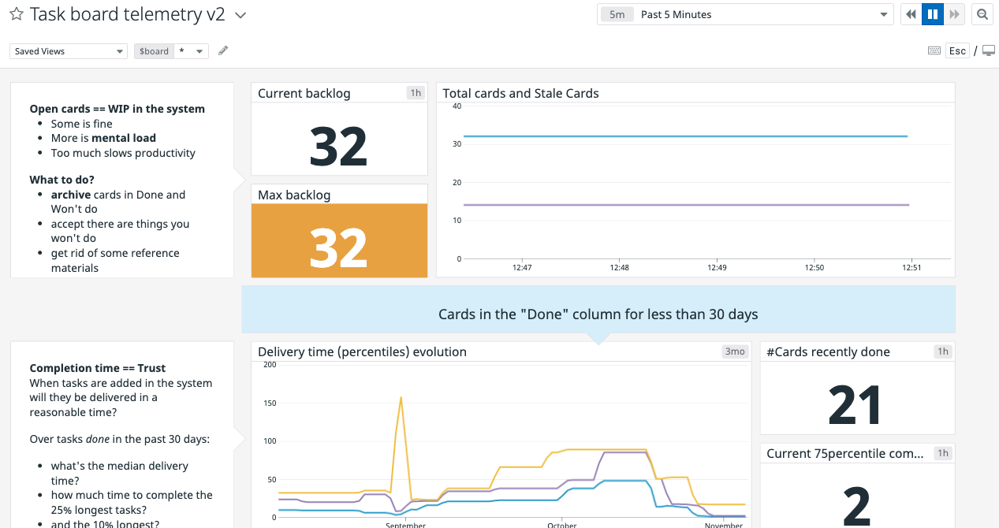

# Metrics to monitor your Trello board tasks

## Requirements

- Trello board: this projects fits boards using a final column where all completed cards are moved then archived - e.g. "To do", "In progress", "Done" or similar.
- Python 3.5
- a [Datadog](https://www.datadoghq.com/) account


## Metrics

- Backlog : number of (unarchived) cards on the board
- Stale cards : number of unarchived cards on the board for more than 30 days (customizable)
- Completion times : histogram (mean, 75th percentile and 90th percentile) of the duration between card creation date and card completion date (card moved to the "Done" column). Computed on all cards (archived and unarchived alike) "done" in the past 30 days (customizable)

Note: Percentile calculation takes more and more time as the number of "finished" cards grows. This script can be configured to have old archived cards removed or moved to a separate board.

## Usage

1. `pip install -r requirements.txt`
2. Set your credentials within `trello_stats.py`
3. Run `python create_dashboard.py` to get a monitoring dashboard (picture below)
4. Run `python trello_stats.py` to collect and push metrics once



## Configuration

Adjust credentials and configs directly in the trello_stats.py main file:

##### Mandatory credentials

```
DD_API_KEY = 'xxxxxxxxxxxxxxxxxxxxxxxxxxxxxxxx'
DD_APP_KEY = 'yyyyyyyyyyyyyyyyyyyyyyyyyyyyyyyyyyyyyyyy'
TRELLO_API_KEY = 'aaaaaaaaaaaaaaaaaaaaaaaaaaaaaaaa'
TRELLO_API_SECRET = 'bbbbbbbbbbbbbbbbbbbbbbbbbbbbbbbbbbbbbbbbbbbbbbbbbbbbbbbbbbbbbbbb'

BOARD_NAME = '<NAME OF YOUR BOARD AS SEEN ON TRELLO'
DONE_LIST_NAME = '<NAME OF YOUR DONE LIST AS SEEN ON TRELLO'
````

##### Additional parameters Optional parameters

```
STALE_CARDS_THRESHOLD_IN_DAYS = 30
COMPLETION_TIME_CARD_AGE_LIMIT = 30 # only cards finished between now and COMPLETION_TIME_CARD_AGE_LIMIT are used for percentiles calculation

SHOULD_CLEANUP = False # percentile calculation takes more and more time as the number of "finished" cards grows. Optionally switch this to True to have old archived cards removed or moved to a separate board
CLEANUP_CARDS_OLDER_THAN_DAYS = 30
MOVE_ARCHIVED_INSTEAD_OF_DELETE = True # False means removing old archive cards
ARCHIVE_BOARD_NAME = '<NAME OF THE OTHER BOARD AS SEEN ON TRELLO>'
ARCHIVE_LIST_NAME = '<NAME OF THE OTHER LIST AS SEEN ON TRELLO>'
```
